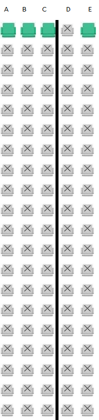

# Airport Booking


    
## booking.java
it contains the booking of airline booking for a airplane (100 passengers)
it collects the intormation of the bokker's name, phone no. , gender, destination, timing ,etc
then it creates

# Preferred Way to run

```bash
# Compiling from src
chmod +x *.sh
./Runner.sh

# From the docker hub
cd prod/
chmod +x *.sh
./Runner.sh
```

# How to Run (manually)

## First java container is created & RUN
```bash
# Frist Compile the Java stage
docker volume create airplane
docker build --target=java-dev -t airplane-jdk .
docker run -it \
  --rm \
  --name airplane-java \
  -v airplane:/usr/src/myapp \
  airplane-jdk bash
```
## Second Python container is created and run
```bash
# Frist Compile the Java stage
docker build --target=image-builder -t airplane-img .
docker run -it \
  --rm \
  --name airplane-img \
  -v airplane:/application \
  airplane-img
```
## ⚠️If you are using windows
> \\wsl.localhost\docker-desktop-data\version-pack-data\community\docker\volumes\airplane\_data
## ⚠️If Linux 
> you can find it in output result of docker volume inspect airplane


### airport tickets.csv
file where the information is stored

### data.txt
for the seat arrangement 

### airplane.txt
for the txt file visual

### new. py  (using data.txt)
creates the image of the seat arrangement(seat arrangement.png)


## Final Output



You can also Contribute
Happy Coding🙂
